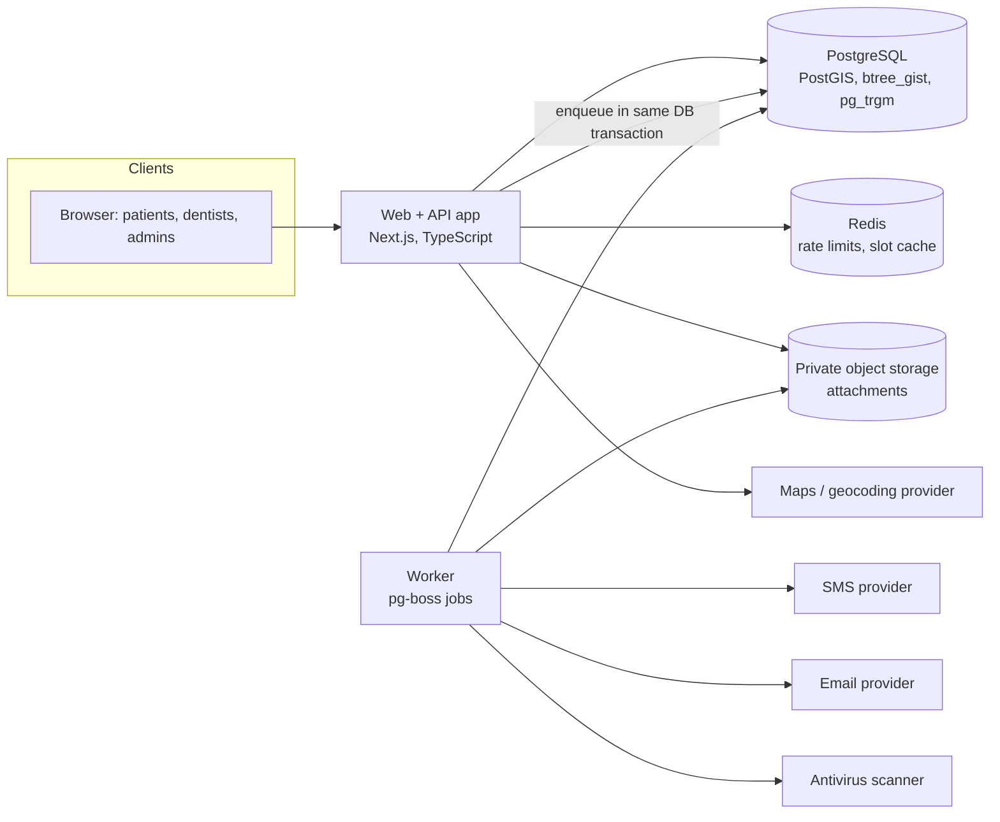

# PLAN: Dentist & Clinic Finder

**Status:** Draft v0.2
**Governed by:** `CONSTITUTION.md`
**Implements:** `SPEC.md` v0.4
**Work items:** `TASKS.md`
**Last updated:** 2026-09-30

**Changelog**
- **v0.2:** Covers SPEC v0.4 (stories US-11 to US-22). New modules `reviews` and `plans`; ADR-016 to ADR-022 (reviews, plans/entitlements, user-generated media, place hierarchy, listing claims, PDF documents, installable web app); data model, API, key designs, tests, risks, and traceability extended; timeline about 16 weeks.
- **v0.1:** Initial plan.

This document turns the requirements in `SPEC.md` into technical decisions. Every decision cites the requirement IDs (S-, F-, R-, P-, A-, U-, B-, REC-, D-, C-, N-) and acceptance criteria (AC-) that drive it. If a decision changes, update the ADR here first, then the tasks.

**Decision status legend:** `Accepted` (build on it), `Proposed` (working assumption, confirm via the listed spike or answer), `Superseded`.

---

## 1. Architecture Overview

A **modular monolith**: one deployable web/API application organized into strictly separated modules, plus a background worker running the same codebase.



**Request paths that matter most**
- *Search:* browser → `search` module → Postgres spatial + full-text query → result cards (+ cached next-slot per dentist).
- *Booking:* browser → `appointments` module → one Postgres transaction (re-validate slot, insert appointment, enqueue notifications) → `201` or `409`.
- *Record read:* browser → `records` module → central policy check → decrypt fields → write access log → response.

---

## 2. Modules & Boundaries

Code lives under `src/modules/<name>/`. A module owns its tables and exposes a small service interface. **Other modules never query its tables directly.** This is enforced by an import-boundary lint rule in CI (T-001).

| Module | Responsibility | Owns (tables) | May call |
|---|---|---|---|
| `platform` | Config, logging, errors, clock, IDs, job queue wrapper, storage wrapper, feature flags | (none) | (none) |
| `identity` | Users, roles, OTP, sessions, MFA, consents, patient profiles, data export/erase | User, PatientProfile, ConsentLog, OtpChallenge, sessions | platform, notifications |
| `providers` | Provider profiles, taxonomy, place hierarchy, credentials, verification, showcase media and content, listing claims, staff | Provider, ProviderMember, ProviderVerification, ProviderCredential, ProviderMedia, ProviderContent, ListingClaim, Place, Specialty, Service, Provider*, ClinicDentist, OpeningHours, HoursException, Photo | platform, identity |
| `search` | Search queries, autocomplete, city pages data | (read models over providers) | providers, scheduling (next slot), platform |
| `scheduling` | Schedules, exceptions, booking settings, appointment types, slot computation | BookingSettings, AppointmentType, ScheduleRule, ScheduleException | providers, platform |
| `appointments` | Booking lifecycle, status transitions, abuse limits | Appointment | scheduling, providers, identity, notifications |
| `records` | Records, prescriptions, bills, addenda, attachments, grants, access log, PDF documents, **authorization policy for records** | DentalRecord, Bill, RecordAttachment, RecordAccessGrant, RecordAccessLog | appointments (relationship check), identity, platform |
| `notifications` | Templates, channel adapters, delivery status | Notification | platform |
| `reviews` | Review submission and eligibility, automated checks, replies, reports, rating aggregates | Review, ReviewReply, ReviewReport, ProviderRatingAggregate | appointments (eligibility), providers, notifications, platform |
| `plans` | Plans, subscriptions, entitlements (`entitlements.can(provider, feature)`), SMS usage | Plan, ProviderSubscription, SmsUsage | providers, platform |
| `content` | Articles, treatment guides, directory content, legal documents, support tickets | Article, LegalDocument, SupportTicket | platform, notifications |
| `admin` | Back-office use cases (verification queue, imports, reports, suspension) | CorrectionReport, AuditLog | all (through service interfaces) |

**Layering inside each module:** `api` (HTTP handlers, validation) → `service` (use cases, authorization) → `repo` (SQL). Domain logic (slot computation, status transitions, policy functions) is pure TypeScript with no framework imports, so it is unit-testable and reusable by a future mobile API.

---

## 3. Stack Summary

| Concern | Choice | Decision |
|---|---|---|
| Architecture | Modular monolith + worker | ADR-001 |
| Web framework | Next.js (React, TypeScript), SSR for public pages | ADR-002 |
| Datastore | PostgreSQL with PostGIS, btree_gist, pg_trgm | ADR-003 |
| Double-booking prevention | Exclusion constraint on appointment time ranges | ADR-004 |
| Availability | Computed from rules on read, short-TTL cache | ADR-005 |
| Search | Postgres full-text + trigram (v1) | ADR-006 |
| Authentication | Mobile OTP for patients; password + TOTP MFA for professionals; server-side sessions | ADR-007 |
| Authorization | Central deny-by-default policy layer | ADR-008 |
| Record protection | Envelope encryption for clinical text; private attachment storage | ADR-009 |
| Async work | pg-boss (Postgres-backed) with transactional enqueue | ADR-010 |
| Notifications | Provider-agnostic adapters; SMS with India DLT compliance | ADR-011 |
| Maps & geocoding | Abstraction; vendor chosen by spike | ADR-012 |
| Hosting | India-region cloud, managed Postgres with point-in-time recovery | ADR-013 |
| Time handling | UTC storage, IANA time zones, injected clock | ADR-014 |
| API style | REST + OpenAPI 3.1, problem+json errors, idempotency keys | ADR-015 |
| Reviews & moderation | Verified-visit reviews, automated checks, moderation queue, aggregate table | ADR-016 |
| Plans & entitlements | Feature flags per plan through one check function; no payments in v1 | ADR-017 |
| Media & user content | Presigned upload, scan, moderate, serve processed copies; video by allowlisted link | ADR-018 |
| Place hierarchy | Curated state > city > locality table with ISR directory pages | ADR-019 |
| Listing claims | Contact-on-record code + admin approval | ADR-020 |
| PDF documents | Server-side templates, generated on demand, access logged | ADR-021 |
| Installable web app | Manifest + service worker for static assets only | ADR-022 |

---

## 4. Decision Log

### ADR-001: Modular monolith, not microservices
**Status:** Accepted
**Drivers:** Small team and a 16-week plan (TASKS.md); booking and records need strong transactional consistency (B-6, REC-5); all modules are needed for P0.
**Options:** (1) Microservices per domain. (2) Modular monolith. (3) Unstructured monolith.
**Decision:** Option 2, with module boundaries enforced by lint and a separate worker process from the same codebase.
**Consequences:** One deploy, one database, easy transactions. Discipline is required to keep module boundaries clean. Modules can be extracted later if scale or team size demands.

### ADR-002: Next.js with server rendering for public pages
**Status:** Accepted
**Drivers:** SEO for profiles, city pages, and guides (SPEC §5 SEO, P-6, C-3); mobile performance (Lighthouse ≥ 85); one language across stack.
**Options:** (1) Next.js SSR/ISR. (2) SPA plus separate API. (3) Server-templated app (Django/Rails).
**Decision:** Option 1. Public pages are server-rendered; authenticated pages are client-driven and `noindex`. API handlers are thin and call module services.
**Consequences:** The domain layer must stay framework-agnostic (see §2) so a mobile app or another client can reuse the API. Framework upgrades need care.

### ADR-003: PostgreSQL + PostGIS as the single primary datastore
**Status:** Accepted
**Drivers:** Radius search and distance sorting (S-3, F-7); overlap-proof bookings (B-6); typo tolerance (S-5); transactional consistency across booking, notifications, and records.
**Options:** (1) Postgres + PostGIS + pg_trgm. (2) Postgres + Elasticsearch/Meilisearch. (3) MongoDB with geo indexes.
**Decision:** Option 1. Extensions: `postgis`, `btree_gist`, `pg_trgm`. Data access is **SQL-first**: versioned SQL migrations plus a typed query builder (e.g. Kysely or Drizzle), with raw SQL for spatial and range operations. Avoid ORMs that hide constraints.
**Consequences:** One system to run and back up. Managed Postgres must support the extensions (verify in SP-4/ADR-013). Search relevance is limited compared to a dedicated engine (see ADR-006).

### ADR-004: Prevent double booking with a database exclusion constraint
**Status:** Accepted (validate with spike SP-1)
**Drivers:** B-6, B-16, AC-13, SPEC §5 Data integrity.
**Options:** (1) Check availability in app code, then insert (race condition). (2) Row or distributed locks (fails on lock expiry, adds moving parts). (3) `EXCLUDE USING gist (dentist_id WITH =, during WITH &&) WHERE status IN ('pending','confirmed')`.
**Decision:** Option 3, plus a transactional re-check of schedule and exceptions before insert.
**Consequences:** Cannot be bypassed by any code path. Requires `btree_gist`. The app maps Postgres error `23P01` to `409 slot_unavailable`. Needs a parallel-request test (T-405, AC-13). Ties us to Postgres, which is already chosen.

### ADR-005: Compute availability on read; do not pre-generate slot rows
**Status:** Accepted
**Drivers:** B-1, B-2, B-3, B-4, B-8, AC-12, AC-17; schedule changes must take effect immediately.
**Options:** (1) Materialize slots per dentist per day. (2) Compute from `ScheduleRule` and `ScheduleException` minus appointments at read time, with a short-TTL cache.
**Decision:** Option 2 (algorithm in §7.1). The booking transaction is always the source of truth; the cache only speeds up listings.
**Consequences:** No slot-table maintenance and no stale rows after rule changes. Requires careful cache invalidation on schedule, exception, and appointment changes, and thorough table-driven unit tests. Next-slot for search cards is computed for the top N results only, and cached.

### ADR-006: Search with Postgres full-text and trigram in v1
**Status:** Accepted, with revisit triggers
**Drivers:** S-1, S-5, R-2; p95 < 800 ms at 100k providers.
**Options:** (1) Postgres FTS + `pg_trgm`. (2) Meilisearch/Typesense. (3) Elasticsearch/OpenSearch.
**Decision:** Option 1.
**Consequences:** No extra infrastructure. **Revisit if** p95 exceeds 300 ms in the load test (SP-4) or relevance tuning (synonyms like "braces" ↔ "orthodontics", multilingual) becomes a priority.

### ADR-007: Authentication and sessions
**Status:** Accepted (patient method to confirm via Open Question 4)
**Drivers:** U-1..U-3, U-9, U-10, D-2, AC-10, AC-11; Indian users commonly verify by mobile number.
**Options for patients:** (1) OTP only. (2) OTP + password. (3) Social login.
**Decision:**
- Patients: mobile OTP is primary (P0). Email + password is optional (P1). OTP codes are 6 digits, stored hashed, expire in 10 minutes, single use, max 5 attempts.
- Professionals: email + password (argon2id) with **TOTP MFA**. Enforce MFA for any account that can read patient records from launch (recommended; SPEC D-2 marks enforcement P1).
- Sessions: server-side session records, opaque random IDs in `Secure`, `HttpOnly`, `SameSite=Lax` cookies. CSRF tokens on state-changing requests. "Log out of all devices" revokes all sessions.
- Rate limits in Redis per identifier and per IP; lockout after 5 failures in 15 minutes; identical responses for unknown and known accounts.
**Consequences:** SMS cost and dependency on delivery (fallback to email if present). Do not hand-roll cryptography; use vetted libraries for hashing, TOTP, and random ID generation.

### ADR-008: Centralized, deny-by-default authorization
**Status:** Accepted (evaluate Postgres row-level security in SP-5)
**Drivers:** U-8, REC-5, REC-6, AC-16, D-7.
**Options:** (1) Ad hoc checks in handlers. (2) Central policy module with role and relationship rules. (3) Postgres row-level security as the only control.
**Decision:** Option 2 as the primary control: pure functions such as `can_read_record(actor, record)` and `can_manage_schedule(actor, dentist)`; every endpoint in `records`, `portal`, and `admin` calls the policy layer. Consider RLS on record tables as defense in depth if SP-5 shows acceptable complexity.
**Consequences:** One place to audit and test. Policy functions get exhaustive allow/deny matrix tests. Access to records requires either authorship, an appointment relationship, or an active patient grant, otherwise deny.

### ADR-009: Protecting clinical records
**Status:** Proposed (depends on legal decisions in Open Question 2 and 3)
**Drivers:** REC-2, REC-5, REC-6, SPEC §5 Data protection and §5.1.
**Decision:**
- Encryption in transit (TLS) and at rest (disk/database encryption).
- **Application-level envelope encryption** for clinical free-text fields (diagnosis, treatment, notes, prescription, medical history) using a KMS-managed key with rotation.
- Attachments in a private bucket with server-side encryption, malware scan before availability, and **short-lived signed URLs** (≈5 minutes) issued only after a policy check.
- No clinical content in logs, analytics, error reports, or notifications (N-5).
**Consequences:** Encrypted fields cannot be searched in SQL. Acceptable because v1 has no cross-patient record search. Key management and rotation runbooks are required.

### ADR-010: Background jobs with pg-boss, enqueued in the same transaction
**Status:** Accepted
**Drivers:** N-1..N-4, B-7 (approval expiry), reminders, exports, scan jobs; must not lose a notification when a booking commits.
**Options:** (1) BullMQ + Redis. (2) Cloud queue (SQS). (3) pg-boss on Postgres.
**Decision:** Option 3. Booking inserts the appointment and enqueues its notification jobs in one transaction. Workers run as a separate process.
**Consequences:** Removes the "committed but never notified" failure mode without an outbox pattern. Queue load shares the primary database (fine at target scale; revisit if job volume grows). Redis is still used, but only for rate limiting and caching.

### ADR-011: Notification adapters and India SMS compliance
**Status:** Proposed (vendor TBD; see SP-3)
**Drivers:** N-1..N-5, U-1, AC-14.
**Decision:** A `NotificationChannel` interface with SMS and email adapters, a template registry with versioned templates, and a fake adapter for tests. All templates contain only provider name, date/time, address, and link (N-5). India SMS requires registered sender IDs and approved templates under TRAI DLT rules; start registration in week 1 because approval has lead time.
**Consequences:** Vendor swap is cheap. Delivery status stored per notification. Retries with backoff and a dead-letter queue.

### ADR-012: Maps and geocoding behind an abstraction
**Status:** Proposed (decided by spike SP-2)
**Drivers:** S-2, A-4, cost and license constraints, quality for Indian addresses.
**Options:** (1) Google Maps Platform. (2) Mapbox. (3) OpenStreetMap stack (MapLibre + Photon/Nominatim or a hosted geocoder).
**Decision:** Implement a `GeoService` interface (autocomplete, geocode, reverse geocode) and a map component wrapper. Pick the vendor after SP-2 compares cost, accuracy on ~50 real addresses, and terms on storing coordinates.
**Consequences:** Provider coordinates are stored in our database; check each vendor's terms on storing and caching results. Keep API keys server-side (autocomplete is proxied).

### ADR-013: Hosting and operations
**Status:** Proposed
**Drivers:** Latency and data-residency expectations (SPEC §5.1), availability 99.5%, RPO ≤ 15 min, RTO ≤ 4 h.
**Decision:** India-region deployment (e.g. AWS ap-south-1 or equivalent) with containerized app and worker, managed PostgreSQL with point-in-time recovery, managed Redis, private object storage, infrastructure as code, and secrets in a secret manager.
**Consequences:** Confirm chosen vendors for SMS, email, analytics, and maps regarding cross-border data transfer. Run a restore drill before launch.

### ADR-014: Time handling
**Status:** Accepted
**Drivers:** B-3, F-3, AC-5, AC-12.
**Decision:**
- Store instants as `timestamptz` (UTC). Store schedule rules as **local time + provider IANA time zone**.
- Use one vetted date-time library (e.g. Luxon or Temporal) for all zone math. Never rely on server-local time.
- Inject a `Clock` so tests can freeze and move time.
- API returns ISO 8601 with offset, plus the zone name for display.
**Consequences:** Small upfront discipline avoids DST and cross-zone bugs, even though India has no DST.

### ADR-015: API style and error handling
**Status:** Accepted
**Drivers:** Frontend/back-end parallel work; future mobile clients; AC-13 retries.
**Decision:** REST with **OpenAPI 3.1** as the contract; generate request/response types from it. Errors use `application/problem+json` with stable machine-readable codes (`slot_unavailable`, `cutoff_passed`, `validation_failed`). `POST /appointments` requires an `Idempotency-Key` header, stored per user with the response for 24 hours.
**Consequences:** Contract tests can be generated from the spec. Version prefix `/api/v1`; breaking changes need a new version.

### ADR-016: Verified-visit reviews with automated checks and moderation
**Status:** Accepted (policy details pending Open Question 16)
**Drivers:** RV-1..RV-8, P-12, AC-25 to AC-27; trust in ratings; legal exposure for defamatory content.
**Options:** (1) Anyone can review any provider. (2) Only patients with a **completed appointment** can review. (3) Embed third-party ratings.
**Decision:** Option 2. Eligibility is checked in the `reviews` module against `appointment.status = 'completed'` for the caller's patient profile, one review per appointment (unique constraint). Submission runs an automated check pipeline (abuse language, phone/email/link patterns, clinical details about third parties), producing `published` or `held`. User reports and held reviews go to an admin moderation queue. A per-provider **rating aggregate table** is recomputed by a job enqueued in the same transaction as any review status change.
**Consequences:** Cold start: few reviews at first, so the average appears only at 3 or more (RV-3). Abuse vector: a provider marking fake appointments completed; mitigate with anomaly checks (many completions with new accounts, same device or network) and review holds. Moderation needs staffing and an SLA (T-709). Providers can reply once but cannot edit or delete. Plans and payments never touch ranking or aggregates (RV-7).

### ADR-017: Plans and entitlements behind one check
**Status:** Proposed (pending Open Question 15)
**Drivers:** D-8, D-15, N-8, A-10, AC-32; IDW gates features by plan (online appointments, patient history, SMS quotas, search placement).
**Options:** (1) Scatter plan checks through the code. (2) A single `entitlements.can(provider, feature)` function reading plan data. (3) Integrate a payment gateway and billing engine now.
**Decision:** Option 2 with plan rows holding a JSON of entitlements (`online_booking`, `records`, `sms_digest`, `priority_listing`, `sms_quota`). No payment collection in v1: payment is offline and an admin activates or extends the subscription (audited). **Default for v1: one all-features plan for every approved provider** until Question 15 is answered; the machinery exists but is not restricting anyone.
**Consequences:** Cheap to add gating later. Guardrails are hard-coded: a downgrade never cancels confirmed appointments, never removes a patient's access to their records, and never blocks OTP or booking confirmations (D-15, N-8). Paid placement, if introduced, is a separate labelled ranking input and never touches ratings.

### ADR-018: User-generated media and content pipeline
**Status:** Accepted
**Drivers:** P-10, D-13, A-11, AC-34, SPEC §5 User-generated content, §5.1.
**Options:** (1) Direct public uploads. (2) Upload to a quarantine area, scan and process, then publish processed copies after moderation. (3) Host video ourselves.
**Decision:** Option 2 for images: presigned upload to a **quarantine bucket**, then a job validates type by content (not file name), size, and dimensions, scans for malware, strips EXIF (including location), creates resized variants, and marks the item `pending` for moderation. Approved variants are copied to a public bucket behind a CDN. **Videos are links** to allowlisted hosts (e.g. YouTube, Vimeo), embedded click-to-load with a CSP `frame-src` allowlist, not hosted by us. Rich text (case studies, blogs) is sanitized with an allowlist. Case studies store a patient-consent attestation and, when required, a consent document in private storage.
**Consequences:** No storage or bandwidth cost for video, and no transcoding. Third-party embed behavior depends on the host. First-time provider content is always moderated (D-13).

### ADR-019: Curated place hierarchy and directory pages
**Status:** Proposed (source data chosen in SP-8)
**Drivers:** S-9, C-3, P-11, AC-22; SEO for state, city, and locality pages.
**Options:** (1) Derive from free-text addresses. (2) Use geocoder-provided admin areas at runtime. (3) Maintain a `Place` table (state, city, locality) with slugs, centroids, and admin editing.
**Decision:** Option 3, seeded from an open dataset or the geocoding vendor, then curated. Each provider references one `locality_id` (set by admin/registration, checked against its coordinates). Directory pages `/dentists/{state}/{city}/{locality}` are server-rendered with revalidation (e.g. hourly) and on-demand revalidation when a provider is published or unpublished. Pages with no providers are `noindex` and suggest nearby localities. Sitemaps are generated from places that have providers. Breadcrumb structured data on each page.
**Consequences:** Stable, readable URLs and predictable SEO. Requires a curation process for new or renamed localities (admin CRUD, T-605).

### ADR-020: Claiming a listing
**Status:** Accepted (verification rules pending Open Question 17)
**Drivers:** D-10, D-1, A-12, AC-28; imported or admin-created listings must reach their real owners without creating duplicates or enabling hijacking.
**Options:** (1) Auto-approve on OTP to the number on record. (2) OTP plus mandatory admin approval. (3) Documents only.
**Decision:** Option 2. The claimant searches for a listing (limited public data, masked contact hints), requests a claim, and enters a code sent to the phone or email **already on record**. A verified code moves the claim to `pending_review`; only an admin approves, after which the claimant becomes `owner` in `ProviderMember`. The previous contacts are notified of every claim and approval. When contacts are unavailable, the claimant uploads documents for manual review. Competing claims are never auto-approved. Requests are rate limited and protected against automation.
**Consequences:** Slower than auto-approval but resistant to number recycling and social engineering. Admin workload scales with claims (see R-10).

### ADR-021: Prescription and bill PDFs
**Status:** Proposed (approach validated in SP-7; content rules pending Open Question 19)
**Drivers:** REC-9, REC-10, AC-29, AC-30, REC-6.
**Options:** (1) Render HTML to PDF with headless Chromium. (2) Template-based PDF library in the worker. (3) A third-party document service.
**Decision:** Option 2 unless SP-7 shows layout limits, with no third-party service for health data. PDFs are generated **on demand** from the finalized record after a policy check, are not stored, and carry a document ID, generation time, and a "system-generated copy" footer. Every generation and download is logged (REC-6). Regional fonts are bundled.
**Consequences:** No stored copies to protect or expire. Layout and font support need care for Indian languages if added later.

### ADR-022: Installable web app without offline health data
**Status:** Accepted
**Drivers:** W-1, AC-35, SPEC §5 Installable web app.
**Decision:** Web app manifest and a service worker that caches only static assets and the app shell. Authenticated and API responses use `Cache-Control: no-store` and are never cached by the service worker; signing out clears caches. An offline page is shown when there is no network.
**Consequences:** No offline access to appointments or records, which is intentional. Native apps remain deferred, and the versioned API keeps that option open.

---

## 5. Data Model

```
User
  id (uuid, pk)
  role            enum: patient | dentist | clinic_staff | admin
  email           text, nullable, unique when present
  mobile          text (E.164), nullable, unique when present
  password_hash   text, nullable
  mfa_secret      text, nullable
  mobile_verified_at, email_verified_at timestamptz
  status          enum: active | suspended | deleted
  created_at, last_login_at

ConsentLog        (id, user_id, consent_type, version, granted_at, withdrawn_at nullable)
OtpChallenge      (id, identifier, code_hash, expires_at, attempts, consumed_at)

PatientProfile
  id, user_id (owner), relationship enum: self | child | spouse | parent | other
  full_name, dob, gender, city
  medical_history jsonb, allergies text[]
  created_at, updated_at

Provider
  id (uuid, pk)
  type            enum: clinic | dentist
  slug            text, unique
  name            text
  description     text
  qualifications  text[], experience_years int, 
  phone           text (E.164)
  email           text, nullable
  website_url     text, nullable
  address_line1, address_line2, city, region, postal_code, country_code
  locality_id     uuid, fk Place (level = locality)
  group_id        uuid, nullable   -- optional chain/organization grouping (see Open Question 21)
  location        geography(Point, 4326)   -- lat/lng, spatially indexed
  timezone        text (IANA)
  languages       text[]
  accessibility   jsonb
  accepts_children boolean
  emergency_care  boolean
  status          enum: draft | pending_verification | published | unpublished | suspended
  booking_enabled boolean
  registration_verified boolean   -- denormalized from ProviderCredential (badge, P-8)
  -- plan and trial live in ProviderSubscription (section 5.1)
  last_verified_at timestamptz
  source          text   -- manual | csv_import | self_registered | third_party
  created_at, updated_at

ProviderMember      (user_id, provider_id, role enum: owner | dentist | staff)
ProviderVerification
  provider_id, council_name, registration_number, document_keys text[],
  status enum: pending | approved | rejected | more_info, reason, reviewed_by, reviewed_at

Specialty          (id, slug, name)
Service            (id, slug, name, specialty_id nullable)
ProviderSpecialty  (provider_id, specialty_id)
ProviderService    (provider_id, service_id, price_range nullable)
ClinicDentist      (clinic_id, dentist_id, role nullable)

OpeningHours       (id, provider_id, day_of_week, opens_at, closes_at)   -- public display hours
HoursException     (id, provider_id, date, closed, opens_at, closes_at, note)

-- Availability & booking
BookingSettings
  provider_id (dentist), mode enum: instant | approval,
  min_notice_minutes default 120, horizon_days default 60,
  cancel_cutoff_minutes default 120, approval_expiry_minutes default 720

AppointmentType    (id, dentist_id, name, duration_minutes, active)

ScheduleRule
  id, dentist_id, clinic_id (nullable for solo practice)
  day_of_week, start_time, end_time, slot_minutes, buffer_minutes,
  valid_from, valid_to nullable
ScheduleException
  id, dentist_id, clinic_id, starts_at, ends_at, kind enum: blocked | extra, reason

Appointment
  id, patient_profile_id, booked_by_user_id
  dentist_id, clinic_id (nullable), appointment_type_id
  during          tstzrange       -- [start, end)
  status          enum: pending | confirmed | cancelled_by_patient | cancelled_by_provider
                       | declined | expired | completed | no_show
  reason_note     text
  idempotency_key text, unique per user
  cancelled_by, cancel_reason, expires_at
  created_at, updated_at
  CONSTRAINT no_overlap
    EXCLUDE USING gist (dentist_id WITH =, during WITH &&)
    WHERE (status IN ('pending', 'confirmed'))

-- Records
DentalRecord
  id, patient_profile_id, appointment_id nullable, clinic_id, dentist_id
  visit_date, chief_complaint, diagnosis, treatment_done,
  tooth_notes jsonb, prescription jsonb, follow_up
  finalized_at, supersedes_record_id nullable   -- addendum link
  created_at
RecordAttachment   (id, record_id, storage_key, mime_type, size_bytes, scan_status)
RecordAccessGrant  (id, patient_profile_id, grantee_provider_id, scope, granted_at, expires_at, revoked_at)
RecordAccessLog    (id, actor_user_id, patient_profile_id, record_id, action, ip, created_at)

-- Supporting
Notification       (id, user_id, channel, template, status, payload jsonb, sent_at, error)
Photo              (id, provider_id, url, alt_text, sort_order)
-- Rating: replaced by ProviderRatingAggregate (section 5.1)
CorrectionReport   (id, provider_id, message, contact_email nullable, status, created_at)
Article            (id, slug, title, body, author, reviewed_by, treatment_slug nullable, status, published_at)
AuditLog           (id, actor_user_id, entity, entity_id, action, diff jsonb, created_at)
```

**Indexes:** GiST on `Provider.location`; GIN on full-text search vector; unique on `slug`; btree on `Provider.status`; btree on `Appointment(dentist_id, status)` and `(patient_profile_id, status)`; btree on `RecordAccessLog(patient_profile_id, created_at)`. The `btree_gist` extension is required for the appointment exclusion constraint. Added in v0.2: unique on `Review(appointment_id)`; partial index on `Review(provider_id) WHERE status = 'published'`; btree on `Place(parent_id, slug)` and `Provider(locality_id, status)`; btree on `ProviderCredential(provider_id, kind)`; unique on `LegalDocument(type, version)`.

### 5.1 Additions (v0.2): geography, credentials, showcase, reviews, claims, plans, billing, support

```
-- Geography (S-9, C-3, ADR-019)
Place              (id, level enum: state | city | locality, parent_id, slug, name,
                    centroid geography, active)

-- Credentials & showcase (P-8..P-10, D-11, D-13, ADR-018)
ProviderCredential (id, provider_id, kind enum: qualification | registration | membership | certification,
                    title, issuer, year, number nullable, document_key nullable,
                    status enum: declared | pending | verified | rejected, verified_by, verified_at)
ProviderMedia      (id, provider_id, kind enum: photo | video_link, storage_key nullable,
                    video_host nullable, url nullable, alt_text,
                    status enum: pending | approved | rejected, sort_order)
ProviderContent    (id, provider_id, kind enum: case_study | blog | publication, title, body,
                    external_url nullable, consent_attested_at nullable, consent_document_key nullable,
                    status enum: draft | pending | published | removed, published_at)

-- Reviews (RV-*, ADR-016)
Review             (id, appointment_id unique, patient_profile_id, provider_id, dentist_id,
                    rating smallint CHECK (rating BETWEEN 1 AND 5), would_recommend boolean nullable,
                    body text, status enum: held | published | removed | deleted,
                    hold_reason, removed_reason, edited_at, created_at)
ReviewReply        (review_id pk, author_user_id, body, created_at)
ReviewReport       (id, review_id, reporter_user_id nullable, reason,
                    status enum: open | actioned | dismissed, created_at)
ProviderRatingAggregate (provider_id pk, average numeric(3,2), count int, updated_at)

-- Listing claims (D-10, ADR-020)
ListingClaim       (id, provider_id, claimant_user_id, method enum: contact_otp | documents,
                    status enum: started | otp_verified | pending_review | approved | rejected,
                    decided_by, decided_at, reason, created_at)

-- Plans & entitlements (D-8, D-15, N-8, ADR-017)
Plan               (id, code, name, entitlements jsonb, sms_monthly_quota, active)
ProviderSubscription (id, provider_id, plan_id, status enum: trial | active | expired | cancelled,
                    starts_at, ends_at, activated_by, payment_reference nullable)
SmsUsage           (provider_id, month, sent)

-- Prescriptions and bills (REC-9, REC-10, ADR-021)
-- DentalRecord.prescription is structured:
--   { items: [ { medicine, strength, dose, frequency, duration, instructions } ], notes }
Bill               (id, patient_profile_id, record_id nullable, appointment_id nullable,
                    clinic_id, dentist_id, items jsonb, subtotal, discount, total,
                    status enum: unpaid | paid_offline | waived, created_at)

-- Support & legal (SUP-*, A-14)
SupportTicket      (id, user_id nullable, name, contact, topic, message, page_url, status, created_at)
LegalDocument      (id, type enum: privacy | terms | disclaimer | about, version, effective_at, body)
-- ConsentLog.version references LegalDocument.version

-- BookingSettings additions (N-7)
BookingSettings +  daily_digest_enabled boolean, daily_digest_time time, digest_channel enum: sms | email
```

---

## 6. API

Base path `/api/v1`. JSON. Public read endpoints are unauthenticated and rate limited. Authenticated endpoints use the session cookie (or bearer token for future apps). All write endpoints are CSRF protected.

### 6.1 Public

**`GET /providers/search`**
| Param | Type | Notes |
|---|---|---|
| `q` | string | free text |
| `lat`, `lng` | number | required together |
| `place_id` or `location` | string | alternative to lat/lng (geocoded server-side) |
| `radius_km` | number | default 10, max 50 |
| `specialty`, `service` | string[] | slugs |
| `open_now` | boolean | |
| `bookable`, `available_today` | boolean | |
| `language` | string[] | ISO 639-1 |
| `emergency`, `accepts_children`, `wheelchair` | boolean | |
| `sort` | enum | `distance` \| `relevance` \| `rating` \| `earliest_slot` |
| `page`, `page_size` | int | default 1 / 20, max 50 |

Response 200 (abridged):
```json
{
  "total": 37, "page": 1, "page_size": 20,
  "results": [{
    "id": "…", "slug": "smile-care-dental-clinic", "name": "Smile Care Dental Clinic",
    "type": "clinic", "specialties": ["general-dentistry", "orthodontics"],
    "distance_km": 1.4, "address": "12 Example Road, City",
    "location": { "lat": 0.0, "lng": 0.0 },
    "is_open_now": true, "phone": "+00…",
    "booking_enabled": true, "next_slot": "2026-10-01T10:30:00+05:30",
    "rating": { "average": 4.6, "count": 128 }, "photo_url": "…"
  }]
}
```
Errors: `400` invalid parameters, `429` rate limited.

- `GET /providers/{slug}`: full profile; `404` if missing or unpublished.
- `GET /providers/{slug}/slots?dentist_id=&type_id=&from=&to=`: available slots (max 14-day window per call) with clinic time zone. Example item: `{ "start": "2026-10-01T10:30:00+05:30", "end": "2026-10-01T11:00:00+05:30" }`.
- `GET /autocomplete/places?input=…`: geocoding proxy so keys stay server-side.
- `GET /taxonomy`: specialties, services, appointment type defaults.
- `POST /reports`: correction report. `201`, or `429`.
- `GET /articles`, `GET /articles/{slug}`: treatment guides and blog.
- `GET /directory/{state}/{city}/{locality?}?type=dentist|clinic&page=`: data for directory pages (S-8, S-9, C-3); `GET /places?level=&parent=` for place pickers. Search also accepts `type=dentist|clinic` and `locality`.
- `GET /providers/{slug}/branches`, `GET /providers/{slug}/reviews?page=`: branches and paged published reviews (profile responses embed credentials, branches, showcase media, and the rating aggregate).
- `GET /legal/{type}`: current version of a policy. `POST /support/tickets`: support and feedback form, rate limited.

### 6.2 Auth & account
- `POST /auth/otp/request` `{ mobile | email }`, `POST /auth/otp/verify` `{ identifier, code, consents[] }`
- `POST /auth/register` (email + password, P1), `POST /auth/login`, `POST /auth/logout`, `POST /auth/logout-all`
- `POST /auth/password/forgot`, `POST /auth/password/reset`
- `GET /me`, `PATCH /me`, `DELETE /me`, `POST /me/export`
- `GET/POST /me/profiles`, `PATCH/DELETE /me/profiles/{id}` (self and dependents)

### 6.3 Appointments (patient)
- `POST /appointments` `{ dentist_id, clinic_id?, appointment_type_id?, start, patient_profile_id, note? }` with header `Idempotency-Key`.
  Responses: `201` created; `401` login required; `409 slot_unavailable`; `422` outside booking window or provider not bookable; `429` abuse limit.
- `GET /appointments?status=upcoming|past`
- `GET /appointments/{id}`
- `POST /appointments/{id}/cancel` `{ reason? }`: `409 cutoff_passed` if too late.
- `POST /appointments/{id}/reschedule` `{ new_start }`
- `POST /appointments/{id}/review` (completed appointments only), `PATCH /reviews/{id}` (within 14 days), `DELETE /reviews/{id}`, `POST /reviews/{id}/report`

### 6.4 Records (patient)
- `GET /me/profiles/{id}/records`, `GET /records/{id}`
- `GET /records/{id}/attachments/{attachment_id}`: returns a short-lived signed URL
- `GET /me/profiles/{id}/access-log`
- `POST /me/profiles/{id}/grants` `{ provider_id, scope, expires_at }`, `DELETE /me/profiles/{id}/grants/{grant_id}`
- `PUT /me/profiles/{id}/medical-history`
- `GET /records/{id}/prescription.pdf`: generated on demand after a policy check; logged
- `GET /me/profiles/{id}/bills`, `GET /bills/{id}.pdf`

### 6.5 Professional portal (`/portal/*`, roles dentist / clinic_staff)
- `POST /portal/registration`, `GET /portal/registration/status`
- `GET/PATCH /portal/provider`: own profile
- `GET/PUT /portal/schedule`, `POST /portal/schedule/exceptions`, `DELETE /portal/schedule/exceptions/{id}`
- `GET/PUT /portal/booking-settings`, `GET/POST/PATCH /portal/appointment-types`
- `GET /portal/appointments?date=&dentist_id=&status=`
- `PATCH /portal/appointments/{id}` `{ action: confirm|decline|cancel|reschedule|complete|no_show, reason? }`
- `GET /portal/patients`, `GET /portal/patients/{profile_id}/records`
- `POST /portal/appointments/{id}/record`, `PATCH /portal/records/{id}` (draft only), `POST /portal/records/{id}/addendum`, `POST /portal/records/{id}/attachments`
- `POST /portal/members` (invite staff), `PATCH/DELETE /portal/members/{id}`
- Claims: `POST /portal/claims/search`, `POST /portal/claims`, `POST /portal/claims/{id}/verify` (code), `POST /portal/claims/{id}/documents`
- Credentials: `GET/POST/PATCH/DELETE /portal/credentials`. Branches: `GET/POST/PATCH /portal/branches`
- Media and content: `POST /portal/uploads/presign`, `GET/POST/PATCH/DELETE /portal/media`, `/portal/content`
- Reviews: `GET /portal/reviews`, `POST /portal/reviews/{id}/reply`, `POST /portal/reviews/{id}/flag`
- Plan: `GET /portal/subscription`. Digest settings are part of `PUT /portal/booking-settings`.
- Prescription and billing: prescription is part of the record; `GET /portal/records/{id}/prescription.pdf`; `POST /portal/records/{id}/bill`, `PATCH /portal/bills/{id}`

### 6.6 Admin (`/admin/*`)
CRUD for providers, specialties, services, articles; `POST /admin/imports` (CSV); `GET/PATCH /admin/reports`; `GET /admin/verifications`, `PATCH /admin/verifications/{id}` (approve / reject / request info); `PATCH /admin/users/{id}` (suspend).

Also: moderation `GET/PATCH /admin/moderation` (reviews, media, content, reports); claims `GET/PATCH /admin/claims`; plans `CRUD /admin/plans`; subscriptions `PATCH /admin/subscriptions/{id}` (activate, extend, end); support `GET/PATCH /admin/support-tickets`; legal `POST /admin/legal-documents`; places `CRUD /admin/places`.

---

## 7. Key Designs

### 7.1 Slot computation (B-3, ADR-005, ADR-014)
Inputs: dentist, clinic, appointment type (or default duration), date window, `now`.
1. Expand `ScheduleRule` rows for each date in the window, in the provider's time zone, honoring `valid_from` and `valid_to`.
2. Subtract `ScheduleException(kind = blocked)`; add `kind = extra`.
3. Cut into slots of the appointment type duration; apply `buffer_minutes` between slots.
4. Subtract active appointments (`pending`, `confirmed`).
5. Drop slots earlier than `now + min_notice_minutes` or later than `now + horizon_days`.
6. Return ISO 8601 with offset. Cache per dentist and day with a short TTL (e.g. 30 s), invalidated on schedule, exception, or appointment changes.

Worked example (must be a unit test, AC-12): Monday 10:00-13:00, 30-minute slots, confirmed appointment at 10:30, blocked 12:00-13:00 → offer exactly 10:00, 11:00, 11:30.

### 7.2 Booking transaction (B-5, B-6, B-16, ADR-004, ADR-010)
```sql
BEGIN;
-- 1. look up idempotency key; if present, return the stored response
-- 2. re-validate: provider bookable, slot inside schedule, not in exception,
--    within notice/horizon, abuse limits (B-14)
INSERT INTO appointment (dentist_id, clinic_id, patient_profile_id, during, status, ...)
VALUES (:dentist_id, :clinic_id, :profile_id, tstzrange(:start, :end, '[)'), :status, ...);
--    the EXCLUDE constraint raises 23P01 on overlap -> HTTP 409 slot_unavailable
-- 3. enqueue notification jobs (pg-boss) in the same transaction
-- 4. store idempotency record with the response
COMMIT;
```
`:status` is `confirmed` in instant mode and `pending` (with `expires_at`) in approval mode.

### 7.3 Record authorization (REC-5, REC-6, ADR-008)
```
can_read_record(actor, record):
  if actor.role == admin           -> deny (admins do not read clinical content)
  if actor is owner of patient profile (or guardian)       -> allow
  if actor is member of record.clinic/dentist AND role permits clinical notes -> allow
  if actor's provider has an appointment/record relationship with the patient
     AND actor role permits clinical notes                 -> allow (own-provider scope)
  if an active, unexpired, unrevoked grant exists for actor's provider -> allow
  else deny
```
Every allow or deny that touches record data writes a `RecordAccessLog` entry. `clinic_staff` sees appointment details but clinical notes only if the clinic owner enabled it. This function is covered by a full allow/deny matrix test.

### 7.4 Search query (S-1..S-4, F-*, ADR-006)
```sql
SELECT p.*, ST_Distance(p.location, ST_MakePoint(:lng, :lat)::geography) / 1000 AS distance_km
FROM provider p
WHERE p.status = 'published'
  AND ST_DWithin(p.location, ST_MakePoint(:lng, :lat)::geography, :radius_km * 1000)
  AND (:q IS NULL OR p.search_vector @@ websearch_to_tsquery('simple', :q))
ORDER BY distance_km ASC
LIMIT :page_size OFFSET :offset;
```
Filters add joins on specialty/service tables and boolean columns. Typo tolerance falls back to trigram similarity on name when the full-text match is empty. Sort by `earliest_slot` uses cached next-slot values for the candidate set only.

### 7.5 Open-now (F-3, AC-5)
Compute in the provider's time zone from `OpeningHours` and `HoursException` (exceptions override). Precompute nothing; evaluate per candidate row in application code for the current page, and use a coarse SQL prefilter when the filter is on.

### 7.6 Review lifecycle and aggregates (RV-*, ADR-016)
1. `POST /appointments/{id}/review`: verify the caller owns the patient profile, the appointment is `completed`, and no review exists (unique constraint).
2. Run automated checks; set status `published` or `held` with a reason.
3. In the same transaction, enqueue an aggregate job for the provider (and the dentist).
4. The job recomputes `average` and `count` from `published` reviews and upserts `ProviderRatingAggregate` (idempotent). Target: visible within 1 minute.
5. Edits within 14 days re-run checks. Deletes and admin removals re-aggregate.
6. Read model: show the average only when `count >= 3`; otherwise show the count. Sorting by rating never reads plan data.

### 7.7 Entitlement check (D-8, D-15, ADR-017)
`entitlements.can(provider_id, feature)` reads the active `ProviderSubscription` and its `Plan.entitlements` (cached about 60 seconds). Callers: booking enablement, records module access for providers, SMS digest, listing priority. Guardrails in code, not configuration: existing appointments stay valid, patients keep record access, OTP and confirmations ignore quotas. For v1 all approved providers get an all-features plan until Open Question 15 is settled.

### 7.8 Listing claim flow (D-10, ADR-020)
Search (rate limited, limited public fields) → `POST /portal/claims` → code sent to the contact on record (masked hint shown) → `POST .../verify` → `pending_review` → admin approves → claimant becomes `owner`; previous contacts notified at each step. Fallback: documents for manual review. Competing claims are never auto-approved.

### 7.9 Directory pages (S-9, C-3, ADR-019)
Route `/dentists/{state}/{city}/{locality}` with a `type` view (dentists or clinics). Server-rendered with hourly revalidation plus on-demand revalidation on publish/unpublish. Locality pages with zero providers return `noindex` and link to nearby localities. Sitemap entries come from `Place` rows that have providers. Breadcrumbs are rendered and emitted as structured data.

---

## 8. Cross-Cutting Rules

These rules implement the principles in `CONSTITUTION.md`. Where a rule here conflicts with an article there, the constitution wins.

| Topic | Rule |
|---|---|
| Identifiers | UUIDs for all primary keys; human-readable `slug` only for public provider URLs |
| Validation | Every request validated against the OpenAPI schema at the edge (e.g. Zod); reject unknown fields |
| Errors | `application/problem+json`; stable `code`; no stack traces or internals in responses |
| Pagination | `page` + `page_size` (max 50) for lists; total count included |
| Idempotency | Required on `POST /appointments`; recommended on other create endpoints |
| Time | See ADR-014; no `new Date()` in domain code, use the injected `Clock` |
| Logging | Structured JSON with request ID; **PII and clinical fields redacted by default** through a shared logger; never log OTPs, tokens, or record text |
| Authorization | Only through the policy layer (§7.3, ADR-008); handlers never inline role checks |
| Transactions | Multi-table writes within a module use one transaction; cross-module effects go through jobs enqueued in that transaction |
| Feature flags | Global `booking` flag and per-provider `booking_enabled` to disable booking safely |
| User-generated content | Everything a user or provider submits (reviews, media, case studies, support messages) is sanitized on input and escaped on output, carries a moderation status, and is shown publicly only when `published` or `approved`. Nothing unmoderated is served from the public bucket |
| Entitlements | Plan-based access is decided only through `entitlements.can(...)`; handlers never inspect plan names |
| Migrations | Forward-only, reviewed SQL migrations; destructive changes need an expand/contract plan |
| Config & secrets | Environment variables validated at startup; secrets only from the secret manager |
| Audit | Admin actions to `AuditLog`; record access to `RecordAccessLog` |
| Accessibility | Design system components have keyboard and screen-reader behavior tested (slot picker included) |

---

## 9. Security & Privacy Design

- **Threats considered:** account takeover via OTP abuse, OTP/SMS pumping (rate limits per IP and per number, cost alerts), enumeration of patients or provider accounts, slot-hoarding bots (B-14, CAPTCHA fallback if abuse appears), IDOR on appointments and records (policy layer plus tests), malicious uploads (scan, type and size limits, no inline rendering), XSS via provider-supplied profile text (escape by default, sanitize rich text), CSRF, secrets leakage. Added in v0.2: fake or coerced reviews and review bombing (eligibility gate, rate limits, anomaly checks, moderation), listing-claim hijacking and number recycling (ADR-020), malicious media and script injection via case studies and blogs (ADR-018), provider phone-number scraping (rate limits and bot protection on directory and profile endpoints), and misuse of generated prescription PDFs (retrieval only through policy checks, document ID and generation time on the page, all access logged).
- **Data minimization:** patient identity shown to a provider only after a booking exists; notifications carry no clinical details; analytics receive coarse location only.
- **Access transparency:** patients can see who accessed their records (REC-6).
- **Deletion and export:** implemented as jobs (U-6, AC-21) with a documented list of retained items.
- **Consent:** `ConsentLog` stores type, version, and timestamps; withdrawal is supported.
- **Legal decisions pending** (SPEC §7 Open Questions 2, 3): the controller/processor role and retention periods can change retention jobs, provider agreements, and ADR-009. Track under Pending Decisions.

---

## 10. Testing Strategy

Principles: tests are derived from the acceptance criteria; integration tests use a **real PostgreSQL** (with extensions) rather than mocks; external services use fake adapters; the clock is injected.

| AC | Primary test level | Notes |
|---|---|---|
| AC-1 | Integration | Fixture providers at 1, 4, 12 km |
| AC-2 | E2E | Browser permission denied |
| AC-3 | Integration + E2E | Combined filters and URL |
| AC-4 | E2E | Open URL in fresh session |
| AC-5 | Unit + integration | Time zone matrix |
| AC-6 | E2E | Empty state action |
| AC-7 | E2E | Mobile viewport; with and without booking |
| AC-8 | Integration + E2E | Unpublish with future appointments |
| AC-9 | Integration | Includes rate limit |
| AC-10 | Integration + E2E | Fake SMS adapter |
| AC-11 | Integration | Lockout and uniform responses |
| AC-12 | Unit (table-driven) + integration | Worked example in §7.1 |
| AC-13 | **Integration concurrency + load** | N parallel requests for one slot; retry with same key |
| AC-14 | Integration + E2E | Notification content contains no clinical data |
| AC-15 | Integration + E2E | Cutoff boundary and atomic reschedule |
| AC-16 | Unit (policy matrix) + integration | Every allow and deny path, grant expiry, revocation |
| AC-17 | Integration + E2E | Conflict resolution flow |
| AC-18 | Integration | Finalize then addendum |
| AC-19 | Integration + E2E | Approve and reject paths |
| AC-20 | E2E | Filter carried to search |
| AC-21 | Integration | Export contents; deletion and retained items |
| AC-22 | Integration + E2E | Locality page, dentists/clinics switch, noindex on empty locality |
| AC-23 | Integration | Verified badge lifecycle when registration changes |
| AC-24 | Integration + E2E | Two branches; cross-branch overlap blocked by the DB constraint |
| AC-25 | Integration + E2E | Eligibility, one review per appointment, 14-day edit window |
| AC-26 | Integration | Moderation queue, aggregate recompute within 1 minute, 3-review threshold |
| AC-27 | Integration | Single reply, no edit or delete by provider |
| AC-28 | Integration + security | OTP limits, competing claims, notifications to existing contacts |
| AC-29 | Integration + unit | PDF content, addendum, access log, deny for unrelated provider |
| AC-30 | Unit + integration | Totals arithmetic, statuses, no payment UI |
| AC-31 | Integration | Digest content, quota fallback, frozen clock |
| AC-32 | Integration | Reminders, downgrade guardrails, audit log |
| AC-33 | Integration + E2E | Footer links on all page types, ticket creation, policy versioning |
| AC-34 | Integration + E2E | Consent attestation, host allowlist, first-post moderation, removal |
| AC-35 | E2E (Lighthouse) | Installability; verify no authenticated data in caches |

Additional suites: accessibility (axe in CI plus manual audit), security (dependency scan, authz/IDOR tests, pen test before launch), performance (search, slots, booking against SPEC §5 targets), and a restore drill for backups.

---

## 11. Environments & Deployment

| Environment | Purpose | Notes |
|---|---|---|
| Local | Development | Docker Compose: Postgres+PostGIS, Redis, MinIO (S3), mail catcher; fake SMS adapter; seed script |
| CI | Every PR | Lint, type-check, boundary rules, unit, integration (real Postgres), E2E on preview, migration check, dependency scan |
| Staging | Pre-release | Production-like, synthetic data only, real vendor sandboxes |
| Production | Live | India region, managed services, backups with PITR, alerting |

Deployment: containers for app and worker, blue/green or rolling with health checks, migrations run before the release with expand/contract for breaking changes, feature flags for risky features (booking, records). Secrets from the secret manager; no secrets in the repository.

---

## 12. Risks & Assumptions

| # | Risk / assumption | Impact | Mitigation |
|---|---|---|---|
| R-1 | SMS sender and template approval (DLT) takes longer than expected | OTP login blocked | Start in week 1 (T-011); email OTP fallback for testing and launch contingency |
| R-2 | Legal role for clinical records is unresolved | Rework of records, retention, agreements | Resolve Open Questions 2 and 3 before M5; keep records behind a feature flag |
| R-3 | Geocoding/maps cost or license limits | Budget overrun or storage restrictions | Abstraction (ADR-012); spike SP-2; cost alerts |
| R-4 | Slot logic bugs (time zones, buffers, exceptions) | Wrong availability shown | Table-driven tests, worked examples, DB constraint as backstop |
| R-5 | Cold start: few providers with live availability | Low booking conversion | Claim-listing flow, pilot with a small set of clinics, "call" fallback when booking disabled |
| R-6 | Verification workload for professionals | Onboarding delays | Clear checklist, admin queue tooling, SLA in Open Question 8 |
| R-7 | Scope (accounts, booking, records, portal, reviews, showcase, plans) exceeds 16 weeks | Late launch | P0/P1 ordering in TASKS.md; records and reviews behind flags; P2 items deferred |
| R-8 | No-shows reduce provider trust | Provider churn | Reminders (N-2), no-show tracking, abuse limits (B-14) |
| R-9 | Review manipulation or legal claims over review content | Loss of trust, legal exposure | Verified-visit rule, automated checks, moderation SLA, takedown process, counsel review (Open Question 16) |
| R-10 | Listing-claim hijacking or claim backlog | Wrong owner controls a profile; slow onboarding | Admin approval always required, notifications to existing contacts, documented fallback, SLA |
| R-11 | Moderation workload for reviews and media grows | Delays, unsafe content | Automated pre-checks, first-post review only, queue tooling, staffing plan (T-709) |
| R-12 | Prescription or bill formats do not meet local rules | Rework or non-compliance | Confirm rules first (Open Question 19); keep REC-9/REC-10 behind flags until reviewed |
| A-1 | Launch region is India, IST only initially | Simplifies zones | Keep zone-aware code anyway (ADR-014) |
| A-2 | English-only UI at launch | i18n later | Externalize strings from day one |

---

## 13. Pending Decisions & Spikes

Spikes are short, time-boxed experiments (1-2 days). Their outcome must be written into the relevant ADR.

| Spike | Question | Decides | Success criterion |
|---|---|---|---|
| SP-1 | Does the exclusion constraint prevent double bookings under load? | ADR-004 | 200 parallel requests for one slot: exactly one `201`, the rest `409`; no deadlocks |
| SP-2 | Which maps/geocoding vendor fits cost, accuracy, and terms? | ADR-012 | Compare on ~50 real local addresses; monthly cost estimate at projected usage |
| SP-3 | Which SMS vendor works with DLT, and what is delivery time? | ADR-011 | OTP delivered in < 10 s on major carriers; templates approved |
| SP-4 | Does Postgres search meet targets at 100k providers? | ADR-003, ADR-006 | Radius + text + filters p95 < 300 ms on staging-sized hardware |
| SP-5 | Is Postgres row-level security worth adding for records? | ADR-008 | Prototype on record tables; measure complexity and query impact |
| SP-6 | Does slot computation stay fast for 50 dentists × 60 days? | ADR-005 | List for a clinic in < 200 ms without cache |
| SP-7 | Can a template-based PDF library produce clear prescription and bill layouts, including regional fonts? | ADR-021 | Sample prescription and bill render correctly on print and mobile |
| SP-8 | Which dataset seeds the state > city > locality hierarchy, and how are localities assigned to providers? | ADR-019 | Seed for 2-3 launch cities; assignment matches coordinates for 95% of test providers |

**Blocking questions from SPEC §7** that must be answered before the milestone that depends on them: 1 (launch geography), 4 (patient login), 5 (SMS/WhatsApp) before M3; 2 and 3 (legal role, retention) before M5; 19 (prescription and bill rules) before enabling T-513 and T-514; 11 (maps vendor) before M1 completes; 15 (plans), 16 (review policy), 17 (claim verification), 18 (case-study consent), 20 (paid placement) before the matching M6b tasks.

---

## 14. Traceability Matrix

| SPEC requirement / AC | Decision(s) | Module(s) | Verified by |
|---|---|---|---|
| S-1..S-5, F-*, R-* | ADR-003, ADR-006, ADR-012 | `search`, `providers` | AC-1, AC-3, AC-4, AC-6 |
| S-6, S-7 | ADR-002 | `search` (UI) | AC-2, AC-4 |
| F-3 (open now) | ADR-014 | `providers`, `search` | AC-5 |
| P-1..P-7 | ADR-002, ADR-005 | `providers`, `scheduling` | AC-7, AC-9 |
| U-1..U-4, U-7, U-9, U-10 | ADR-007 | `identity` | AC-10, AC-11 |
| U-6 | ADR-010 | `identity` | AC-21 |
| U-8, REC-5 | ADR-008 | policy layer | AC-16 |
| B-1..B-4, B-8 | ADR-005, ADR-014 | `scheduling` | AC-12 |
| B-5, B-6, B-16 | ADR-004, ADR-010, ADR-015 | `appointments` | AC-13, AC-14 |
| B-7, B-9..B-12 | ADR-010 | `appointments` | AC-14, AC-15 |
| B-14 | ADR-007 (rate limits) | `appointments` | AC-13 (limits), abuse tests |
| N-1..N-5 | ADR-010, ADR-011 | `notifications` | AC-14 |
| REC-1..REC-4, REC-6, REC-7 | ADR-008, ADR-009 | `records` | AC-16, AC-18 |
| D-1, A-7 | ADR-008 | `providers`, `admin` | AC-19 |
| D-2 | ADR-007 | `identity` | AC-10 (professional path), security tests |
| D-4, D-5, B-10 | ADR-005, ADR-010 | `scheduling`, `appointments` | AC-17 |
| A-2, A-8 | ADR-008 | `admin`, `providers` | AC-8 |
| C-1..C-4 | ADR-002 | `content` | AC-20 |
| SPEC §5 Performance | ADR-003, ADR-005, ADR-006 | all | SP-4, SP-6, load tests |
| SPEC §5 Data protection, §5.1 | ADR-009, ADR-013 | `records`, `platform` | Security review, restore drill |
| F-1, F-2, F-4, F-5, F-8, F-9 | ADR-003, ADR-006 | `search`, `providers` | AC-3 |
| F-6 (rating filter, P2) | ADR-016 | `search`, `reviews` | AC-26 (aggregates), T-638 |
| U-5 (dependents) | ADR-008 | `identity` | AC-14 (book for dependent), AC-16 |
| A-3, A-5, A-6, A-9 | ADR-015 | `admin`, `content` | Integration tests per tool; AC-9 |
| D-3, D-6, D-9 | ADR-008, ADR-018 | `providers`, `records` | AC-19, AC-16 |
| Deferred (P2): B-13, B-15, REC-8, N-6, C-5 | none yet | n/a | Backlog |
| S-8, S-9, C-3, P-11 | ADR-019 | `providers`, `search`, `content` | AC-22 |
| P-8, D-11 | ADR-008, ADR-020 (admin approval) | `providers` | AC-23 |
| P-9, D-12, B-5 (branch) | ADR-004 | `providers`, `scheduling`, `appointments` | AC-24 |
| P-10, D-13, A-11 | ADR-018 | `providers`, `admin` | AC-34 |
| RV-1..RV-8, P-12, D-14 | ADR-016, ADR-010 | `reviews` | AC-25, AC-26, AC-27 |
| D-10, A-12 | ADR-020 | `providers`, `admin` | AC-28 |
| D-8, D-15, N-8, A-10 | ADR-017 | `plans` | AC-32 |
| REC-9 | ADR-021, ADR-008, ADR-009 | `records` | AC-29 |
| REC-10 | ADR-021 | `records` | AC-30 |
| N-7 | ADR-010, ADR-011 | `notifications`, `scheduling` | AC-31 |
| SUP-1..SUP-5, A-13, A-14 | ADR-015 | `content`, `admin` | AC-33 |
| W-1 | ADR-022 | web app shell | AC-35 |
